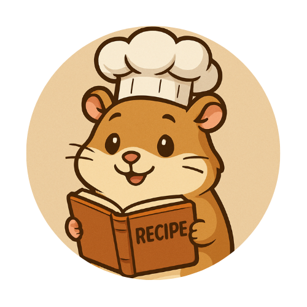
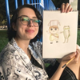

## **Takım İsmi**

**TastyTiles** 

## **Takım Logosu**

## Takım Elemanları

|    | 
Name
   | 
Title
  | 
Socials
     |
| :-----------: | :---------- | :---------- | :----------: |
|    | Eren Kam     | Product Owner     |    | 
|      | Ayşe Umay Gezer     | Scrum Master     |  |
|    | Bengü Ceren Özler      | Developer      |     |
|     | Selin Sena Gürsoy    | Developer     |        |
|     | Kerem Çelikman    | Developer     |        |
|     | İlknur Çelik      | Developer     |        |

## Oyun İsmi

Hey Gusto!

## Oyun Logosu

  

## Oyun Açıklaması
Dünya'daki çeşitli mutfaklara girip özgün tarifler için doğru malzeme kombinasyonları sağlayın. Yeni mutfaklar keşfedebilmek için size verilen tariflerdeki malzemeleri doğru sırayla bulmaya çalışın.

## Oyun Hikayesi
Ana karakterimiz dünyayı gezerek çeşitli tarifler toplayan bir lezzet avcısıdır. Kendi yemek kitabını oluşturmak için bir maceraya atılıyor. Bu yolda, efsanevi tarifleri ve gizli tekniklerini öğreniyor.

## Oyun Özellikleri
Kolay tek parmak kullanımı, Puzzle türü, eşleştirme ve seçme fonksiyonlarına sahip. Hafıza geliştirici. Kültürel farkındalık sağlayıcı. Rahatlatıcı, Öğretici içerik. Hızlı turlar.

## Hedef Kitle
8 yaş üstü, Aileye uygun içerik. Gastronomiye ilgili, yemek ile ilgili herkes. Commuting-time oyunu.

## Pazarlama Planı
Instagram ve Google ads'de demo videoları ile reklam. Oyun içindeki assetlerin özel tasarımlarında marka yerleştirme.

## Product Backlog URL

[Trello Backlog Board]() ([https://trello.com/b/EdFDZjUN/kanban-template)])

---

# Sprint 1

- **Sprint Notları**: User Story'ler product backlog'ların içine yazılmıştır. Product backlog item'lara tıklandığında hikayelerin detayları okunabilmektedir.

- **Sprint içinde tamamlanması tahmin edilen puan**: 10 Puan

- **Puan tamamlama mantığı**: Proje boyunca tamamlanması gereken backlog puanı 30'dır. İlk Sprint için bitirilmesi istenilen puan sayısı 10 olarak belirlenmiştir .

- **Backlog düzeni ve Story seçimleri**: Backlog'umuz bir sonraki sprintlerin temelini atacak şekilde düzenlenmiştir. Sprint başına tahmin edilen puan sayısını geçmeyecek şekilde görevler dağıtılmıştır. Figjam'i ilham panosu olarak kullandık ve referanslar üzerinden fikir geliştirdik. Sonra buradaki fikirleri Trello'ya aktararak görev dağılımı yaptık. 
Mavi etiketli olan görevler "kod", Yeşil etiketli olan görevler "dökümantasyon", Mor etiketli olan görevler "tasarım" olarak sınıflandırıldı.
Sprint'in son günü yapılanlar gözden geçirildi ve diğer sprinte hazırlık yapıldı.

- **Daily Scrum**: Daily Scrum toplantılarının Meet üzerinden yapılması kararlaştırılmıştır. Daily Scrum toplantılarımız ve günün raporlarını Whatsapp üzerinden grupça paylaştık.

- **Sprint board update**: Sprint board screenshot: 
 

# 
<h3>Ürün Durumu: Ekran Görüntüleri</h3>

- **Sprint Review**: 
  - Üretilen assetler birlikte değerlendirildi. Level design ve oyun için gerekli olan assetler listelendi. Görev paylaşımı yapıldı. Tasarım tarafında etiketli görevler ve kod tarafında etiketli görevler devam ettiriliyor.
  - Birlikte kararlaştırılan ortak günlerde bir araya gelindi. Sprint Review katılımcıları: Bengü Ceren Özler, Kerem Çelikman, Eren Kam, İlknur Çelik, Ayşe Umay Gezer. Selin Gürsoy çalışmalarını ileterek eşlik etti.
- **Sprint Retrospective:** 
  - Tasarım tarafı güçlü olan ekip 6 sahne belirledi. Bunlardan 4. ve 2. sahneler çalışılıyor. Assetler ve karakter tasarımları sürüyor. Tasarım ve kodlama tarafı eş zamanlı olarak yürütülüyor.
Kodlama grubu ağırlıklı olarak: Kerem Çelikman, İlknur Çelik, Eren Kam
Tasarım grubu çoğunlukla: Selin Gürsoy, Bengü Ceren Özler, Ayşe Umay Gezer ile yürütülüyor. Gruplar toplantılardaki fikir alışverişleri sırasında görev dağılımı yapıp devam ediyor.
  - Toplantıların belirli bir zaman aralığıyla gerçekleştirilmesi kararlaştırıldı.
  - Üretim aşamasında görev alan ekip üyelerine gelecek bölümlerde ihtiyaç duyulabilecek assetlerin üretimi için listeler hazırlandı

